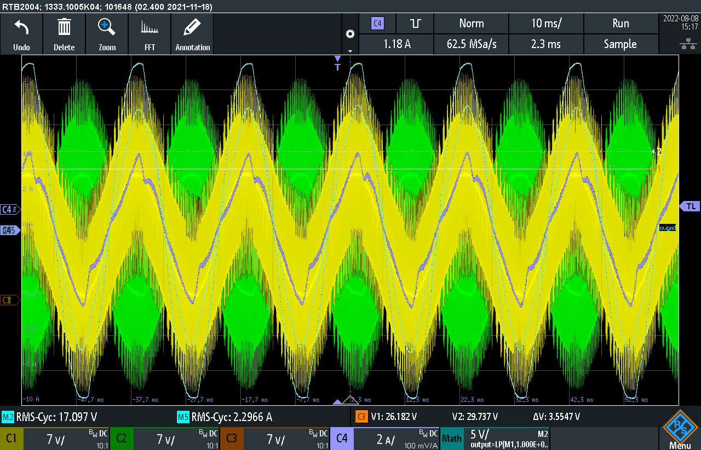

# STMInverter - PV inverter based on STM32F030

This project was inspired by some disused PV modules. Instead of recycling the modules, they were upcycled.
Mounted on a wood storage shed, they can produce some energy and protect the wood from water at the same time👍  
The picture shows the installation with two of four modules mounted.


But in order to use the solar power in a comfortable way, an inverter is necessary. Lets build a small PV inverter!

System overview:
```
  __________________________________     _________________     _____________     __________     __________________
 |                                  |   |                 |   |             |   |          |   |                  |
 | 2 strings parallel               |   |  Capacitor bank |   |             |   |          |   | 16.43 V to 230 V |
 |   2 x 53 W PV modules per string |-->|   6 x 1.1 mF    |-->| Full-bridge |-->| L-filter |-->| 50Hz transformer |
 |   17.6 Vmpp per module           |   |                 |   |             |   |          |   |                  |
 |__________________________________|   |_________________|   |_____________|   |__________|   |__________________|
```
## Controller

The inverter is controlled by a microcontroller, which runs the following elements:
```
  _____________      ____________________        _____________________        ___       _____________
 |             | V  |                    |  I   |                     |  V   |   | V   |             |
 | MPP-Tracker |--->| Voltage controller | ---> | Current feedforward | ---> | + |---> | dutycycle   |--> PWM
 |  (ToDo)     |    |                    |      |   (sensorless)      |      | + |     | calculation |
 |_____________|    |____________________|      |_____________________|      |___|     |_____________|
                                                 __________                    ^
                                       V_grid   |          |   V_grid_estim    |
                                       -------> | SOGI-PLL | ------------------
                                                |__________|
```

##### MPP-Tracker = Maximum Power Point Tracker
extracts maximum power from PV modules

##### Voltage controller
controls the DC-voltage to the desired voltage of the MPP-Tracker

In single phase systems, a 100Hz DC-link power ripple occurs.  
In order to  keep this ripple away from the controller, we calculate:

$$\begin{aligned} V_\mathrm{c} &= V_\mathrm{c0} + \frac{1}{C} \cdot \int_0^t (i_\mathrm{pv}-i_\mathrm{out}) \mathrm{d}t \\
               &= V_\mathrm{c0} + \frac{1}{C} \cdot ( i_\mathrm{pv} \cdot t - \int_0^t (\frac{V_\mathrm{ac,amp} I_\mathrm{ac,amp} \sin^2(\omega t)}{V_\mathrm{dc}}) \mathrm{d}t ) \\
               &= V_\mathrm{c0} + \frac{1}{C} \cdot ( i_\mathrm{pv} \cdot t - \frac{V_\mathrm{ac,amp} I_\mathrm{ac,amp}}{V_\mathrm{dc}} \cdot (-\underbrace{\frac{\sin(\omega t) \cdot \cos(\omega t)}{2\omega}}_{\frac{\sin(2\omega)}{4\omega}} + \frac{t}{2} ))
\end{aligned}$$

Thus, the ac-part of the capacitor voltage is:

$$V_\mathrm{c,ac} = \frac{V_\mathrm{ac,amp} I_\mathrm{ac,amp}}{C \cdot V_\mathrm{dc} \cdot 4\omega} \cdot \sin(2\omega t) $$

##### Current feedforward (sensorless)
calculates the output voltage based on the desired current from the voltage controller using the system model. No current sensor is installed. The current control is not steady-state accurate, but this is not a problem, because of the superimposed voltage controller.

##### SOGI-PLL = Second-order Generalized Integrator Phase-Locked Loop
detects the grid voltage and phase for feedforward control

## Simulation
In order to simulate the control alogrithms, see pythonSimulation/Readme.md
[pythonSimulation/Readme.md](pythonSimulation/Readme.md)

## Implementation

The STM32CubeIDE and the integrated STM32CubeMX init code generation tools are used to program the microcontroller.

## Results

All measurements are done at the low voltage side of the transformer:  
Chn1(yellow) and Chn2(green) show the full-bridge PWM output voltages.  
Chn3(orange) shows the DC-voltage (no curve visible).  
Chn4(blue) shows the output current.  
Math channels show the low-pass filtered output voltage and current. -> Vout and Iout are in-phase.

# Todo
Implement MPP-Tracker. At the moment, 30V Mosfets are used which limit the voltage, so an MPP-Tracker is useless.

The amplitude of the PLL quadrature signals, v and qv matches the amplitude of the input signal v only when the centre frequency of the filter, ω matches the input frequency.  
-> ω feedback has to be implemented. Otherwise, in case of grid frequency variations the feedforwarded grid voltage has different amplitude.

The PLL detects 50Hz only. If pure sinusoidal current should be fed into the grid, more sophisticated PLL structures or current controllers are necessary. But this approach seems to be a grid-friendly approach, since harmonics are partially compensated by the inverter.

For grid islandig detection, more sophisticated methods should be implemented. At the moment, the grid is valid if 50Hz +-1Hz and Vgrid_amplitude_nom +-10% are detected.  


